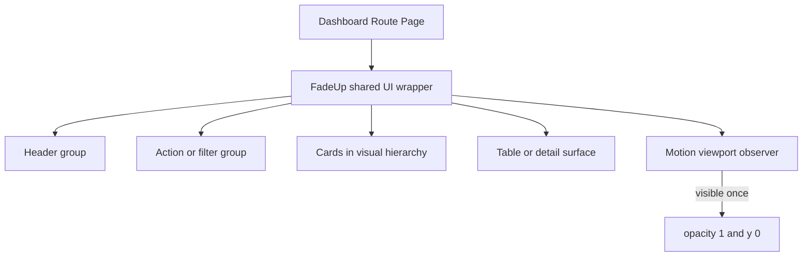

# Dashboard Pages Fade-Up — Planning Output (v1)

> **Status:** PLANEJADO — Aguardando aprovação  
> **Data:** 2026-06-03  
> **Scope:** `/dashboard/health`, `/dashboard/leads`, `/dashboard/leads/[leadId]`  
> **Files:** 3 arquivos modificados, 0 componentes novos  
> **Risk:** 🟢 LOW

---

## 1. Contexto

The three requested dashboard pages currently render their visual hierarchy without entrance animation:

- `Health Config`: page heading, save action, configuration cards, benchmark editor.
- `Leads Table`: page heading, base filters, metric cards, conditional filters, leads table.
- `Lead Detail`: page heading, back action, lead detail card.

The project already has a shared `FadeUp` design-system component and an approved dashboard usage pattern. The adjustment will reuse that component with `offset={-24}` so each animated group starts with a negative Y position and `opacity: 0`, then moves to its natural Y position and restores opacity when visible in the viewport.

The shared component already enforces one-time viewport animation through `viewport={{ once: true }}` and respects reduced-motion preferences. No new component, dependency, state, mock data, or feature will be introduced.

### Technical Mapping

**Issue:** The requested dashboard pages do not use the existing fade-up entrance behavior.  
**Suspected Root Cause:** Their top-level visual groups are rendered as plain `div`, `section`, `Card`, and `Button` elements instead of using the shared `FadeUp` wrapper.  
**Target Outcome:** Each visual group enters once from `y: -24` and `opacity: 0`, then reaches `y: 0` and `opacity: 1` when visible. Initially visible groups follow a delay queue based on screen hierarchy.  
**Risks & Mitigation:** A wrapper can affect grid or flex behavior if layout classes remain on the child. Layout classes will be moved to or retained on the `FadeUp` wrapper as required, and responsive routes will be visually verified.

### Risk Assessment

```text
Point #1: Health Config fade-up hierarchy
├── Risk Level: 🟢 LOW
├── Blast Radius: /dashboard/health visual entrance only
├── Regression Surface: responsive grid alignment and form interaction
└── Confidence: HIGH

Point #2: Leads Table fade-up hierarchy
├── Risk Level: 🟢 LOW
├── Blast Radius: /dashboard/leads visual entrance only
├── Regression Surface: metric grid sizing, filters, table and pagination layout
└── Confidence: HIGH

Point #3: Lead Detail fade-up hierarchy
├── Risk Level: 🟢 LOW
├── Blast Radius: /dashboard/leads/[leadId] visual entrance only
├── Regression Surface: header alignment and detail card layout
└── Confidence: HIGH
```

### AIOS / Workspace Notes

- The workspace-level `.agent/rules/aios.md` and `dev-acjustment` skill were loaded.
- Context7 research was completed for current Motion for React viewport and sequencing patterns.
- No `squads/` directory exists in `dashboard/`.
- `dashboard/` is not inside a Git repository, so the required pre-implementation commit and Git rollback reference cannot be created locally.

---

## 2. Referência de Código Mapeada

### 2.1 Shared Fade-Up Component

[fade-up.tsx](/Users/brunogovas/Projects/Projetos%20Solo/dashboard/components/ui/fade-up.tsx:13)

```tsx
export function FadeUp({
  children,
  className,
  delay = 0,
  offset = 28,
  amount = 0.22,
  transition,
  viewport,
  ...props
}: FadeUpProps) {
  const shouldReduceMotion = useReducedMotion()

  return (
    <motion.div
      className={cn(className)}
      initial={shouldReduceMotion ? false : { opacity: 0, y: offset }}
      whileInView={shouldReduceMotion ? undefined : { opacity: 1, y: 0 }}
      viewport={{ once: true, amount, ...viewport }}
      transition={{
        duration: 0.7,
        ease: [0.22, 1, 0.36, 1],
        delay,
        ...transition,
      }}
      {...props}
    >
      {children}
    </motion.div>
  )
}
```

↑ This component already implements the requested opacity, Y-position, viewport visibility, one-time execution, easing, delay, and reduced-motion behavior.

### 2.2 Existing Dashboard Negative-Y Queue Pattern

[page.tsx](/Users/brunogovas/Projects/Projetos%20Solo/dashboard/app/dashboard/page.tsx:51)

```tsx
<div className="mx-auto flex w-full max-w-[1480px] flex-col gap-8 px-5 py-6 sm:px-8 lg:px-10 lg:py-8">
  <div className="grid gap-5 xl:grid-cols-[minmax(0,1fr)_640px] xl:items-end">
    <FadeUp
      offset={-24}
      delay={0.04}
      className="flex min-w-0 flex-col gap-3"
    >
      ...
    </FadeUp>

    <FadeUp offset={-24} delay={0.12}>
      ...
    </FadeUp>
  </div>
```

[page.tsx](/Users/brunogovas/Projects/Projetos%20Solo/dashboard/app/dashboard/page.tsx:115)

```tsx
{kpis.map((kpi, index) => (
  <FadeUp
    key={kpi.label}
    offset={-24}
    delay={0.2 + index * 0.08}
    className="h-full"
  >
    <Card className="h-full">
      ...
    </Card>
  </FadeUp>
))}
```

↑ The existing dashboard establishes the exact requested direction (`offset={-24}`) and a hierarchy queue using `0.08` second increments.

### 2.3 Health Config Visual Groups

[page.tsx](/Users/brunogovas/Projects/Projetos%20Solo/dashboard/app/dashboard/health/page.tsx:230)

```tsx
<div className="mx-auto flex w-full max-w-[1480px] flex-col gap-6 px-5 py-6 sm:px-8 lg:px-10 lg:py-8">
  <div className="flex flex-col gap-5 lg:flex-row lg:items-end lg:justify-between">
    <div className="flex min-w-0 flex-col gap-3">
      ...
    </div>
    <Button
      className="w-fit"
      onClick={saveChanges}
      disabled={!hasUnsavedChanges}
    >
      ...
    </Button>
  </div>

  <section className="grid items-start gap-6 xl:grid-cols-[340px_minmax(0,1fr)]">
    <div className="grid gap-6">
      <Card>...</Card>
      <Card>...</Card>
      <Card>...</Card>
      <Card className="overflow-hidden p-0">...</Card>
    </div>

    <Card className="overflow-hidden">
      ...
    </Card>
  </section>
</div>
```

↑ These are the top-level Health Config groups that will receive the shared wrapper without changing form logic.

### 2.4 Leads Table Visual Groups

[page.tsx](/Users/brunogovas/Projects/Projetos%20Solo/dashboard/app/dashboard/leads/page.tsx:137)

```tsx
<div className="mx-auto flex w-full max-w-[1480px] flex-col gap-5 px-5 py-6 sm:px-8 lg:px-10 lg:py-8">
  <div className="grid gap-5 xl:grid-cols-[minmax(0,1fr)_640px] xl:items-end">
    <div className="flex min-w-0 flex-col gap-3">
      ...
    </div>

    <Card className="py-4">
      ...
    </Card>
  </div>

  <section className="grid gap-4 md:grid-cols-3">
    {metrics.map((metric) => (
      <Card key={metric.label}>...</Card>
    ))}
  </section>

  <section className="flex flex-col gap-5">
    <Card>...</Card>
    <Card className="overflow-hidden">...</Card>
  </section>
</div>
```

↑ This page already has a clear screen hierarchy that maps directly to the approved dashboard queue pattern.

### 2.5 Lead Detail Visual Groups

[page.tsx](/Users/brunogovas/Projects/Projetos%20Solo/dashboard/app/dashboard/leads/%5BleadId%5D/page.tsx:266)

```tsx
<div className="mx-auto flex w-full max-w-[1480px] flex-col gap-5 px-5 py-6 sm:px-8 lg:px-10 lg:py-8">
  <div className="flex flex-col gap-5 lg:flex-row lg:items-end lg:justify-between">
    <div className="flex min-w-0 flex-col gap-3">
      ...
    </div>

    <Button asChild variant="outline" className="w-fit">
      ...
    </Button>
  </div>

  <Card className="overflow-hidden p-0">
    ...
  </Card>
</div>
```

↑ The lead detail content has three top-level groups: heading, back action, and the detail card.

---

## 3. Lógica de Implementação

### 3.1 Viewport-Triggered One-Time Reveal

**Origem:** `[REPO EXISTENTE]` + `[CONTEXT7]`

```tsx
<FadeUp offset={-24} delay={0.04}>
  {children}
</FadeUp>
```

The shared component maps this usage to:

```tsx
initial={{ opacity: 0, y: -24 }}
whileInView={{ opacity: 1, y: 0 }}
viewport={{ once: true, amount: 0.22 }}
```

Context7 confirms the current Motion for React pattern of starting from an `initial` opacity/Y state, animating when an element enters view, and sequencing visible elements with staggered timing. The repository implementation remains the source of truth because it already wraps those Motion behaviors and adds reduced-motion support.

### 3.2 Health Config Queue

**Origem:** `[REPO EXISTENTE]` + `[CRIADO]`

```tsx
import { FadeUp } from "@/components/ui/fade-up"

<FadeUp offset={-24} delay={0.04} className="flex min-w-0 flex-col gap-3">
  {/* Header badges, title, and description */}
</FadeUp>

<FadeUp offset={-24} delay={0.12} className="w-fit">
  {/* Save action */}
</FadeUp>

<FadeUp offset={-24} delay={0.2}>
  {/* Selected niche card */}
</FadeUp>

<FadeUp offset={-24} delay={0.28} amount={0.12}>
  {/* Healthy minimum metrics card */}
</FadeUp>

<FadeUp offset={-24} delay={0.36}>
  {/* Copy benchmarks card */}
</FadeUp>

<FadeUp offset={-24} delay={0.44}>
  {/* Other niches card */}
</FadeUp>

<FadeUp offset={-24} delay={0.52}>
  {/* Benchmark image card */}
</FadeUp>
```

Flow: header first, then action, then the top configuration/editor groups, followed by the secondary sidebar groups. On smaller screens, each group still waits for its own viewport entry and runs only once.

### 3.3 Leads Table Queue

**Origem:** `[REPO EXISTENTE]` + `[CRIADO]`

```tsx
import { FadeUp } from "@/components/ui/fade-up"

<FadeUp offset={-24} delay={0.04} className="flex min-w-0 flex-col gap-3">
  {/* Header */}
</FadeUp>

<FadeUp offset={-24} delay={0.12}>
  {/* Base filters */}
</FadeUp>

{metrics.map((metric, index) => (
  <FadeUp
    key={metric.label}
    offset={-24}
    delay={0.2 + index * 0.08}
    className="h-full"
  >
    <Card className="h-full">{/* Metric content */}</Card>
  </FadeUp>
))}

<FadeUp offset={-24} delay={0.44} amount={0.12}>
  {/* Conditional filters */}
</FadeUp>

<FadeUp offset={-24} delay={0.52} amount={0.12}>
  {/* Leads table */}
</FadeUp>
```

Flow: header first, base filters second, metric cards from left to right, conditional filters, and the leads table last.

### 3.4 Lead Detail Queue

**Origem:** `[REPO EXISTENTE]` + `[CRIADO]`

```tsx
import { FadeUp } from "@/components/ui/fade-up"

<FadeUp offset={-24} delay={0.04} className="flex min-w-0 flex-col gap-3">
  {/* Header */}
</FadeUp>

<FadeUp offset={-24} delay={0.12} className="w-fit">
  {/* Back action */}
</FadeUp>

<FadeUp offset={-24} delay={0.2} amount={0.12}>
  <Card className="overflow-hidden p-0">
    {/* Lead profile and event timeline */}
  </Card>
</FadeUp>
```

Flow: page context first, navigation action second, then the lead profile/timeline surface.

---

## 4. Arquitetura de Componentes



---

## 5. CSS/SCSS Reference

### 5.1 Existing Layout Classes Preserved

[page.tsx](/Users/brunogovas/Projects/Projetos%20Solo/dashboard/app/dashboard/page.tsx:53)

```tsx
<FadeUp
  offset={-24}
  delay={0.04}
  className="flex min-w-0 flex-col gap-3"
>
```

**Adaptações necessárias:**

| Propriedade | Valor Original | Novo Valor |
|-------------|---------------|------------|
| Layout classes | Applied to plain `div` or child `Card` | Applied to `FadeUp` when the wrapper becomes the layout item |
| Initial Y | No animated Y state | `offset={-24}` |
| Initial opacity | No animated opacity state | Inherited `opacity: 0` from `FadeUp` |
| Visible state | Immediate render | Inherited `opacity: 1, y: 0` |
| Repeat behavior | Not applicable | Inherited `viewport.once: true` |

No CSS or SCSS file will be modified.

---

## 6. Novos Componentes

No new components will be created. The existing `@/components/ui/fade-up` component is mandatory reuse.

---

## 7. Componentes Modificados

### 7.1 `app/dashboard/health/page.tsx`

**New import:**

```tsx
import { FadeUp } from "@/components/ui/fade-up"
```

**Modifications:**

```tsx
<FadeUp offset={-24} delay={0.04} className="flex min-w-0 flex-col gap-3">
  {/* existing header content */}
</FadeUp>
```

Wrap the existing save action, sidebar cards, and main metrics card with the queue documented in Section 3.2. Existing state and handlers remain unchanged.

### 7.2 `app/dashboard/leads/page.tsx`

**New import:**

```tsx
import { FadeUp } from "@/components/ui/fade-up"
```

**Modifications:**

```tsx
{metrics.map((metric, index) => (
  <FadeUp
    key={metric.label}
    offset={-24}
    delay={0.2 + index * 0.08}
    className="h-full"
  >
    <Card className="h-full">
      {/* existing metric content */}
    </Card>
  </FadeUp>
))}
```

Wrap the existing header, base filters, metric cards, conditional filters, and table card with the queue documented in Section 3.3. Existing filter state remains unchanged.

### 7.3 `app/dashboard/leads/[leadId]/page.tsx`

**New import:**

```tsx
import { FadeUp } from "@/components/ui/fade-up"
```

**Modifications:**

```tsx
<FadeUp offset={-24} delay={0.2} amount={0.12}>
  <Card className="overflow-hidden p-0">
    {/* existing lead profile and timeline */}
  </Card>
</FadeUp>
```

Wrap the existing page heading, back action, and lead detail card with the queue documented in Section 3.4. Navigation, clipboard, tooltip, and timeline logic remain unchanged.

---

## 8. i18n Keys

Not applicable. No copy changes or new keys are required.

---

## 9. Files Summary

| Action | File | Risk |
|--------|------|------|
| **MODIFY** | `app/dashboard/health/page.tsx` | 🟢 LOW |
| **MODIFY** | `app/dashboard/leads/page.tsx` | 🟢 LOW |
| **MODIFY** | `app/dashboard/leads/[leadId]/page.tsx` | 🟢 LOW |

---

## 10. Implementation Order

1. **Phase A:** Apply and validate the Health Config hierarchy queue.
2. **Phase B:** Apply and validate the Leads Table hierarchy queue.
3. **Phase C:** Apply and validate the Lead Detail hierarchy queue.
4. **Phase D:** Run build and visual verification across desktop and mobile.
5. **Phase E:** Create the required session handoff.

The workflow will validate one page before moving to the next page.

---

## 11. Rollback Plan

```text
Componentes modificados:
├── Git Ref: unavailable — dashboard/ is not inside a Git repository
├── Files to restore:
│   ├── app/dashboard/health/page.tsx
│   ├── app/dashboard/leads/page.tsx
│   └── app/dashboard/leads/[leadId]/page.tsx
├── Revert command: unavailable without a repository or external source-control reference
└── Validation: confirm the three routes render without FadeUp wrappers
```

Implementation should not begin until the stakeholder accepts this rollback limitation or places the project under source control.

---

## 12. Verification Plan

| # | Test Case | Route | Expected |
|---|-----------|-------|----------|
| 1 | Header entrance | `/dashboard/health` | Header starts above with zero opacity, then settles once |
| 2 | Health hierarchy queue | `/dashboard/health` | Header, action, configuration/editor groups, and secondary cards follow visual hierarchy |
| 3 | Health form integrity | `/dashboard/health` | Selects, inputs, copy, and save behavior remain usable |
| 4 | Leads initial queue | `/dashboard/leads` | Header, filters, and metric cards appear in order |
| 5 | Leads viewport reveal | `/dashboard/leads` | Conditional filters and table reveal once when visible |
| 6 | Leads interaction integrity | `/dashboard/leads` | Filter toggles, links, table, and pagination remain usable |
| 7 | Lead detail queue | `/dashboard/leads/ld_00284` | Header, back action, and detail card appear in order |
| 8 | Lead detail interaction integrity | `/dashboard/leads/ld_00284` | Back link, copy action, tooltips, and timeline remain usable |
| 9 | One-time behavior | All affected routes | Scrolling away and back does not replay the animation |
| 10 | Reduced motion | All affected routes | Users preferring reduced motion do not receive the entrance animation |
| 11 | Responsive layout | All affected routes | No wrapper causes grid, flex, table, or card alignment regression |
| 12 | Build validation | Project root | `npm run build` passes |

---

## 13. Handoff

No external integration is required. A final implementation handoff will be created in `docs/sessions/2026-06/` after the approved changes and verification are complete.

Um wraper é um componente que engloba outro componente. Por isso dizemos que iremos adicionar um wraper dentro de um componente.

O fade-up é um wraper aplicado em componentes que querem ter o efeito de fade-up. Ou seja, ao criar animações, é possível criar wrappers para as animações e então, aplicá-las em componentes espcíficos. 
